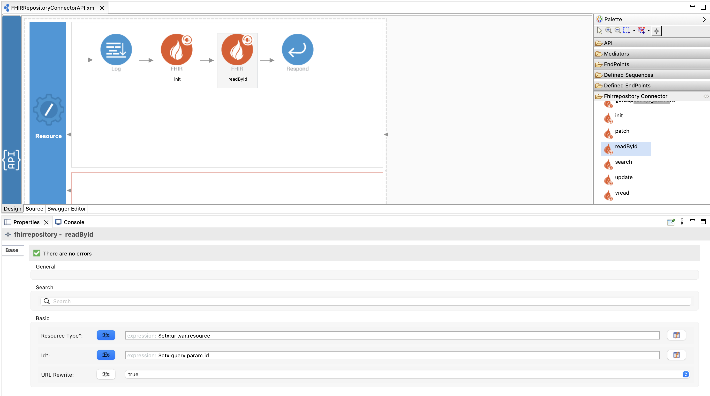

# Working with the FHIR Repository Connector
[[  Overview ]](#overview)  [[ Operation details ]](#operation-details)

### Prerequisite

Please see [Configuring FHIR Repository Connector](config.md) to properly configure the FHIR repository connector before 
you start using the connector operations. 

### Overview

Fast Healthcare Interoperability Resources (FHIR) is an interoperability standard for electronic exchange of healthcare information. 
The WSO2 FHIR Repository connector can be used to invoke FHIR operations within WSO2 Micro Integrator mediation logic.

This connector is currently being developed to support the Azure FHIR Repository and any other FHIR Repository with either 
OAuth2.0 based security or no security. Please let us know if you have any other requirements. Tested with Azure FHIR Repository 
and HAPI FHIR Repository R4/R5.

All the connector operations are configurable using WSO2 Integration Studio's no code graphical editor like any other 
Connector.



See the [Connector Usage Guidelines](https://mi.docs.wso2.com/en/latest/reference/connectors/connector-usage/)
for more information.

```editorconfig
Note: You could use Synapse expressions as the values of any properties of the connector operations as follows (within curly
braces);

<fhirrepository.readById>
 <resourceType>{$ctx:uri.var.resource}</resourceType>
 <id>{$ctx:query.param.id}</id>
 <urlRewrite>true</urlRewrite>
</fhirrepository.readById>
```

The following operations allow you to work with the FHIR Repository connector. Click an operation name to see details on how to use it.

| Operation                                                     | Description                                                                         |
|---------------------------------------------------------------|-------------------------------------------------------------------------------------|
| [batch](#Batch-Operation)                                     | Create a new FHIR bundle.                                                           |
| [connect](#Connect-Operation)                                 | Proxies a FHIR repository so that any type of API request are routed intelligently. |
| [create](#Create-Operation)                                   | Create a new resource with a server assigned id.                                    |
| [delete](#Delete-Operation)                                   | Delete a resource.                                                                  |
| [getCapabilityStatement](#Get-Capability-Statement-Operation) | Get a capability statement for the system.                                          |
| [patch](#Patch-Operation)                                     | Update an existing resource by posting a set of changes to it.                      |
| [readById](#Read-By-ID-Operation)                             | Retrieve a resource using its id.                                                   |
| [search](#Search-Operation)                                   | Search resources by giving query parameters.                                        |
| [update](#Update-Operation)                                   | Update an existing resource by its id.                                              |
| [vread](#Version-Read-Operation)                              | Read the state of a specific version of the resource.                               |
                 

## Operation details
This section provides details on each of the operations.

### Batch Operation

**Properties**
* urlRewrite : (_Optional_) Boolean value whether you want to rewrite FHIR server URL

```xml
<?xml version="1.0" encoding="UTF-8"?>
<api context="/r4" name="FHIRRepositoryConnectorAPI" xmlns="http://ws.apache.org/ns/synapse">
    <resource faultSequence="FhirRepositoryFaultSequence" methods="DELETE POST PUT PATCH GET">
        <inSequence>
            <fhirrepository.init/>
            <fhirrepository.batch>
                <urlRewrite>true</urlRewrite>
            </fhirrepository.batch>
            <respond/>
        </inSequence>
        <outSequence/>
    </resource>
</api>

```

* This operation allows to create a new FHIR bundle.
* It will POST the FHIR bundle to the FHIR server's base URL.

Following is a sample REST request to create a new FHIR bundle.

```
curl -v -X POST http://localhost:8290/r4 -d @bundle.json -H "Content-type: application/fhir+json"
```

You can use the Content-type as "application/json" also
```
curl -v -X POST http://localhost:8290/r4/batch -d @bundle.json -H "Content-type: application/json"
```

Sample payload(bundle.json)
```json
{
  "resourceType": "Bundle",
  "type": "batch",
  "entry": [
    {
      "fullUrl": "urn:uuid:5586f623-1391-40e9-a8cc-ed32cf5b607d",
      "resource": {
        "resourceType": "Patient",
        "id": "5586f623-1391-40e9-a8cc-ed32cf5b607d",
        "text": {
          "status": "generated",
          "div": "<div xmlns=\"http://www.w3.org/1999/xhtml\">Generated by <a href=\"https://github.com/synthetichealth/synthea\">Synthea</a>.Version identifier: v2.4.0-404-ge7ce2295\n .   Person seed: 8190460250141936893  Population seed: 0</div>"
        },
        "extension": [
          {
            "url": "http://hl7.org/fhir/us/core/StructureDefinition/us-core-race",
            "extension": [
              {
                "url": "ombCategory",
                "valueCoding": {
                  "system": "urn:oid:2.16.840.1.113883.6.238",
                  "code": "2106-3",
                  "display": "White"
                }
              },
              {
                "url": "text",
                "valueString": "White"
              }
            ]
          },
          {
            "url": "http://hl7.org/fhir/us/core/StructureDefinition/us-core-ethnicity",
            "extension": [
              {
                "url": "ombCategory",
                "valueCoding": {
                  "system": "urn:oid:2.16.840.1.113883.6.238",
                  "code": "2186-5",
                  "display": "Not Hispanic or Latino"
                }
              },
              {
                "url": "text",
                "valueString": "Not Hispanic or Latino"
              }
            ]
          },
          {
            "url": "http://hl7.org/fhir/StructureDefinition/patient-mothersMaidenName",
            "valueString": "Beulah33 Batz141"
          },
          {
            "url": "http://hl7.org/fhir/us/core/StructureDefinition/us-core-birthsex",
            "valueCode": "M"
          },
          {
            "url": "http://hl7.org/fhir/StructureDefinition/patient-birthPlace",
            "valueAddress": {
              "city": "Orange",
              "state": "Massachusetts",
              "country": "US"
            }
          },
          {
            "url": "http://synthetichealth.github.io/synthea/disability-adjusted-life-years",
            "valueDecimal": 0.0
          },
          {
            "url": "http://synthetichealth.github.io/synthea/quality-adjusted-life-years",
            "valueDecimal": 0.0
          }
        ],
        "name": [
          {
            "use": "official",
            "family": "Chri",
            "given": [
              "Jewella"
            ]
          }
        ],
        "telecom": [
          {
            "system": "phone",
            "value": "555-430-2020",
            "use": "home"
          }
        ],
        "gender": "male",
        "birthDate": "2019-01-15",
        "address": [
          {
            "extension": [
              {
                "url": "http://hl7.org/fhir/StructureDefinition/geolocation",
                "extension": [
                  {
                    "url": "latitude",
                    "valueDecimal": 42.492116386479395
                  },
                  {
                    "url": "longitude",
                    "valueDecimal": -70.9878307878303
                  }
                ]
              }
            ],
            "line": [
              "1099 Franecki Rue Unit 60"
            ],
            "city": "Melrose",
            "state": "Massachusetts",
            "postalCode": "02176",
            "country": "US"
          }
        ],
        "maritalStatus": {
          "coding": [
            {
              "system": "http://terminology.hl7.org/CodeSystem/v3-MaritalStatus",
              "code": "S",
              "display": "Never Married"
            }
          ],
          "text": "Never Married"
        },
        "multipleBirthBoolean": false,
        "communication": [
          {
            "language": {
              "coding": [
                {
                  "system": "urn:ietf:bcp:47",
                  "code": "en-US",
                  "display": "English"
                }
              ],
              "text": "English"
            }
          }
        ]
      },
      "request": {
        "method": "POST",
        "url": "Patient"
      }
    }
  ]
}
```

Sample response
```json
{
    "resourceType": "Bundle",
    "type": "batch-response",
    "entry": [
        {
            "resource": {
                "resourceType": "Patient",
                "id": "4789a72c-4975-4175-8664-385317d067c9",
                "meta": {
                    "versionId": "1",
                    "lastUpdated": "2022-02-10T09:35:11.782+00:00"
                },
                "text": {
                    "status": "generated",
                    "div": "<div xmlns=\"http://www.w3.org/1999/xhtml\">Generated by <a href=\"https://github.com/synthetichealth/synthea\">Synthea</a>.Version identifier: v2.4.0-404-ge7ce2295\n .   Person seed: 8190460250141936893  Population seed: 0</div>"
                },
                "extension": [
                    {
                        "extension": [
                            {
                                "url": "ombCategory",
                                "valueCoding": {
                                    "system": "urn:oid:2.16.840.1.113883.6.238",
                                    "code": "2106-3",
                                    "display": "White"
                                }
                            },
                            {
                                "url": "text",
                                "valueString": "White"
                            }
                        ],
                        "url": "http://hl7.org/fhir/us/core/StructureDefinition/us-core-race"
                    },
                    {
                        "extension": [
                            {
                                "url": "ombCategory",
                                "valueCoding": {
                                    "system": "urn:oid:2.16.840.1.113883.6.238",
                                    "code": "2186-5",
                                    "display": "Not Hispanic or Latino"
                                }
                            },
                            {
                                "url": "text",
                                "valueString": "Not Hispanic or Latino"
                            }
                        ],
                        "url": "http://hl7.org/fhir/us/core/StructureDefinition/us-core-ethnicity"
                    },
                    {
                        "url": "http://hl7.org/fhir/StructureDefinition/patient-mothersMaidenName",
                        "valueString": "Beulah33 Batz141"
                    },
                    {
                        "url": "http://hl7.org/fhir/us/core/StructureDefinition/us-core-birthsex",
                        "valueCode": "M"
                    },
                    {
                        "url": "http://hl7.org/fhir/StructureDefinition/patient-birthPlace",
                        "valueAddress": {
                            "city": "Orange",
                            "state": "Massachusetts",
                            "country": "US"
                        }
                    },
                    {
                        "url": "http://synthetichealth.github.io/synthea/disability-adjusted-life-years",
                        "valueDecimal": 0.0
                    },
                    {
                        "url": "http://synthetichealth.github.io/synthea/quality-adjusted-life-years",
                        "valueDecimal": 0.0
                    }
                ],
                "name": [
                    {
                        "use": "official",
                        "family": "Chri",
                        "given": [
                            "Jewella"
                        ]
                    }
                ],
                "telecom": [
                    {
                        "system": "phone",
                        "value": "555-430-2020",
                        "use": "home"
                    }
                ],
                "gender": "male",
                "birthDate": "2019-01-15",
                "address": [
                    {
                        "extension": [
                            {
                                "extension": [
                                    {
                                        "url": "latitude",
                                        "valueDecimal": 42.492116386479395
                                    },
                                    {
                                        "url": "longitude",
                                        "valueDecimal": -70.9878307878303
                                    }
                                ],
                                "url": "http://hl7.org/fhir/StructureDefinition/geolocation"
                            }
                        ],
                        "line": [
                            "1099 Franecki Rue Unit 60"
                        ],
                        "city": "Melrose",
                        "state": "Massachusetts",
                        "postalCode": "02176",
                        "country": "US"
                    }
                ],
                "maritalStatus": {
                    "coding": [
                        {
                            "system": "http://terminology.hl7.org/CodeSystem/v3-MaritalStatus",
                            "code": "S",
                            "display": "Never Married"
                        }
                    ],
                    "text": "Never Married"
                },
                "multipleBirthBoolean": false,
                "communication": [
                    {
                        "language": {
                            "coding": [
                                {
                                    "system": "urn:ietf:bcp:47",
                                    "code": "en-US",
                                    "display": "English"
                                }
                            ],
                            "text": "English"
                        }
                    }
                ]
            },
            "response": {
                "status": "201",
                "location": "https://ohfhirrepositorypoc-ohfhirrepositorypoc.fhir.azurehealthcareapis.com/Patient/4789a72c-4975-4175-8664-385317d067c9/_history/1",
                "etag": "W/\"1\"",
                "lastModified": "2022-02-10T09:35:11+00:00"
            }
        }
    ]
}
```

### Connect Operation

**Properties**
* resourceType : (_Optional_) The type of the resource (Ex: Patient)
* urlRewrite : (_Optional_) Boolean value whether you want to rewrite FHIR server URL

```xml
<?xml version="1.0" encoding="UTF-8"?>
<api context="/r4" name="FHIRRepositoryConnectorAPI" xmlns="http://ws.apache.org/ns/synapse">
    <resource faultSequence="FhirRepositoryFaultSequence" methods="DELETE POST PUT PATCH GET">
        <inSequence>
            <fhirrepository.init/>
            <fhirrepository.connect>
                <urlRewrite>true</urlRewrite>
            </fhirrepository.connect>
            <respond/>
        </inSequence>
        <outSequence/>
    </resource>
</api>

```

* This operation is ideal for exposing FHIR server as a FHIR API (kind of proxy-style) via integration layer in a controlled manner.
* Connect operation detects intelligently incoming FHIR API request and handle the FHIR API call to back-end FHIR respository server.

> Note : You must use the correct HTTP method, headers and the full endpoint URL to perform the connect operation.

##### GET

Following is a sample REST request to retrieve a patient using the patient name.
```
curl -v -X GET http://localhost:8290/r4/Patient?name=Nisini
```

##### POST

Following is a sample REST request to create a new patient resource.

```
curl -v -X POST http://localhost:8290/r4/Patient -H "Content-Type: application/json" -d @data.json
```
##### PUT

Following is a sample REST request to update an existing patient resource by its id.

```
curl -v -X PUT -H "Content-Type: application/json" -d @data.json http://localhost:8290/r4/Patient/0e906902-a4b6-4bd7-83cf-0bd6a5968baa
```

##### DELETE

Following is a sample REST request to delete a patient resource.

```
curl -v -X DELETE http://localhost:8290/r4/Patient/b3aa84ff-2958-4525-8cb1-82512f6bb145
```

##### PATCH

Following is a sample REST request to update an existing resource by posting a set of changes to it.

>Note : Azure FHIR Server currently support json patches only.

>Note : You have to use the Content-Type as “application/json-patch+json”


```
curl -v -X PATCH http://localhost:8290/r4/Patient/94f24813-9fe7-4191-a9dc-733909a6d591 -H "Content-Type: application/json-patch+json" -d @patch.json
```

Sample json request body (patch.json)

```json
[
{ 
   "op": "replace", 
   "path": "/birthDate", 
   "value": "1999-09-16" 
}
]
```
### Create Operation

**Properties**

* resourceType : (_Mandatory_) The type of the resource (Ex: Patient)
* urlRewrite : (_Optional_) Boolean value whether you want to rewrite FHIR server URL

```xml
<?xml version="1.0" encoding="UTF-8"?>
<api context="/r4" name="FHIRRepositoryConnectorAPI" xmlns="http://ws.apache.org/ns/synapse">
    <resource faultSequence="FhirRepositoryFaultSequence" methods="DELETE POST PUT PATCH GET">
        <inSequence>
            <fhirrepository.init/>
            <fhirrepository.create>
                <resourceType>Patient</resourceType>
                <urlRewrite>true</urlRewrite>
            </fhirrepository.create>
            <respond/>
        </inSequence>
        <outSequence/>
    </resource>
</api>

```

Following is a sample REST request to create a new resource.

```
curl -v -X POST http://localhost:8290/r4 -H "Content-Type: application/json" -d @data.json
```

### Delete Operation

**Properties**
* resourceType : (_Mandatory_) The type of the resource (Ex: Patient)
* id : (_Mandatory_) The logical ID of the resource (Ex: 61db4f41-2a28-4647-914c-72f3558bcaaf)
* urlRewrite : (_Optional_) Boolean value whether you want to rewrite FHIR server URL


```xml
<?xml version="1.0" encoding="UTF-8"?>
<api context="/r4" name="FHIRRepositoryConnectorAPI" xmlns="http://ws.apache.org/ns/synapse">
    <resource faultSequence="FhirRepositoryFaultSequence" methods="DELETE POST PUT PATCH GET">
        <inSequence>
            <fhirrepository.init/>
            <fhirrepository.delete>
                <resourceType>Patient</resourceType>
                <id>8e76bd23-e065-4921-b90d-6116d3a0dbe2</id>
            </fhirrepository.delete>
            <respond/>
        </inSequence>
        <outSequence/>
    </resource>
</api>
```
Following is a sample REST request to delete a resource.

```
curl -v -X DELETE http://localhost:8290/r4
```
### Get Capability Statement Operation

**Properties**
* urlRewrite : (_Optional_) Boolean value whether you want to rewrite FHIR server URL

```xml
<?xml version="1.0" encoding="UTF-8"?>
<api context="/r4" name="FHIRRepositoryConnectorAPI" xmlns="http://ws.apache.org/ns/synapse">
    <resource faultSequence="FhirRepositoryFaultSequence" methods="DELETE POST PUT PATCH GET">
        <inSequence>
            <fhirrepository.init/>
            <fhirrepository.getCapabilityStatement>
                <urlRewrite>true</urlRewrite>
            </fhirrepository.getCapabilityStatement>
            <respond/>
        </inSequence>
        <outSequence/>
    </resource>
</api>

```

Following is a sample REST request to get the capability statement.

```
curl -v -X GET http://localhost:8290/r4
```

### Patch Operation
**Properties**

* resourceType : (_Mandatory_) The type of the resource (Ex: Patient)
* id : (_Mandatory_) The logical ID of the resource (Ex: 61db4f41-2a28-4647-914c-72f3558bcaaf)
* urlRewrite : (_Optional_) Boolean value whether you want to rewrite FHIR server URL

```xml
<?xml version="1.0" encoding="UTF-8"?>
<api context="/r4" name="FHIRRepositoryConnectorAPI" xmlns="http://ws.apache.org/ns/synapse">
    <resource faultSequence="FhirRepositoryFaultSequence" methods="DELETE POST PUT PATCH GET">
        <inSequence>
            <fhirrepository.init/>
            <fhirrepository.patch>
                <resourceType>Patient</resourceType>
                <id>5fdd5542-721e-4704-882d-912279af6b3a</id>
                <urlRewrite>true</urlRewrite>
            </fhirrepository.patch>
            <respond/>
        </inSequence>
        <outSequence/>
    </resource>
</api>

```

Following is a sample REST request to get the capability statement.

```
curl -v -X PATCH http://localhost:8290/r4 -H "Content-Type: application/json-patch+json" -d @patch.json
```

### Read By ID Operation

**Properties**

* resourceType : (_Mandatory_) The type of the resource (Ex: Patient)
* id : (_Mandatory_) The logical ID of the resource (Ex: 61db4f41-2a28-4647-914c-72f3558bcaaf)
* urlRewrite : (_Optional_) Boolean value whether you want to rewrite FHIR server URL

```xml
<?xml version="1.0" encoding="UTF-8"?>
<api context="/r4" name="FHIRRepositoryConnectorAPI" xmlns="http://ws.apache.org/ns/synapse">
    <resource faultSequence="FhirRepositoryFaultSequence" methods="DELETE POST PUT PATCH GET">
        <inSequence>
            <fhirrepository.init/>
            <fhirrepository.readById>
                <resourceType>Patient</resourceType>
                <id>5fdd5542-721e-4704-882d-912279af6b3a</id>
                <urlRewrite>true</urlRewrite>
            </fhirrepository.readById>
            <respond/>
        </inSequence>
        <outSequence/>
    </resource>
</api>

```

Following is a sample REST request to retrieve a resource using its id.

```
curl -v -X GET http://localhost:8290/r4
```

### Search Operation

**Properties**

* resourceType : (_Mandatory_) The type of the resource (Ex: Patient)
* queryParameters : (_Optional_) The parameter name and the value (Ex: name=Sandamini)
* urlRewrite : (_Optional_) Boolean value whether you want to rewrite FHIR server URL

```xml
<?xml version="1.0" encoding="UTF-8"?>
<api context="/r4" name="FHIRRepositoryConnectorAPI" xmlns="http://ws.apache.org/ns/synapse">
    <resource faultSequence="FhirRepositoryFaultSequence" methods="DELETE POST PUT PATCH GET">
        <inSequence>
            <fhirrepository.init/>
            <fhirrepository.search>
                <resourceType>Patient</resourceType>
                <queryParameters>name=Nisini</queryParameters>
                <urlRewrite>true</urlRewrite>
            </fhirrepository.search>
            <respond/>
        </inSequence>
        <outSequence/>
    </resource>
</api>

```

Following is a sample REST request to retrieve a resource using its search query parameters.

```
curl -v -X GET http://localhost:8290/r4
```

### Update Operation

**Properties**

* resourceType : (_Mandatory_) The type of the resource (Ex: Patient)
* id : (_Mandatory_) The logical ID of the resource (Ex: 61db4f41-2a28-4647-914c-72f3558bcaaf)
* urlRewrite : (_Optional_) Boolean value whether you want to rewrite FHIR server URL

```xml
<?xml version="1.0" encoding="UTF-8"?>
<api context="/r4" name="FHIRRepositoryConnectorAPI" xmlns="http://ws.apache.org/ns/synapse">
    <resource faultSequence="FhirRepositoryFaultSequence" methods="DELETE POST PUT PATCH GET">
        <inSequence>
            <fhirrepository.init/>
            <fhirrepository.update>
                <resourceType>Patient</resourceType>
                <id>5fdd5542-721e-4704-882d-912279af6b3a</id>
                <urlRewrite>true</urlRewrite>
            </fhirrepository.update>
            <respond/>
        </inSequence>
        <outSequence/>
    </resource>
</api>

```
Following is a sample REST request to update a resource using its ID.
```
curl -v -X PUT -H "Content-Type: application/json" -d @data.json http://localhost:8290/r4
```

### Version Read Operation

**Properties**

* resourceType : (_Mandatory_) The type of the resource (Ex: Patient)
* id : (_Mandatory_) The logical ID of the resource (Ex: 61db4f41-2a28-4647-914c-72f3558bcaaf)
* versionId : (_Mandatory_) The version ID of the resource
* urlRewrite : (_Optional_) Boolean value whether you want to rewrite FHIR server URL

```xml
<?xml version="1.0" encoding="UTF-8"?>
<api context="/r4" name="FHIRRepositoryConnectorAPI" xmlns="http://ws.apache.org/ns/synapse">
    <resource faultSequence="FhirRepositoryFaultSequence" methods="DELETE POST PUT PATCH GET">
        <inSequence>
            <fhirrepository.init/>
            <fhirrepository.vread>
                <resourceType>Patient</resourceType>
                <id>5fdd5542-721e-4704-882d-912279af6b3a</id>
                <versionId>1</versionId>
                <urlRewrite>true</urlRewrite>
            </fhirrepository.vread>
            <respond/>
        </inSequence>
        <outSequence/>
    </resource>
</api>

```

Following is a sample REST request to read the state of a specific version of the resource. 
```
curl -v -X GET http://localhost:8290/r4
```
